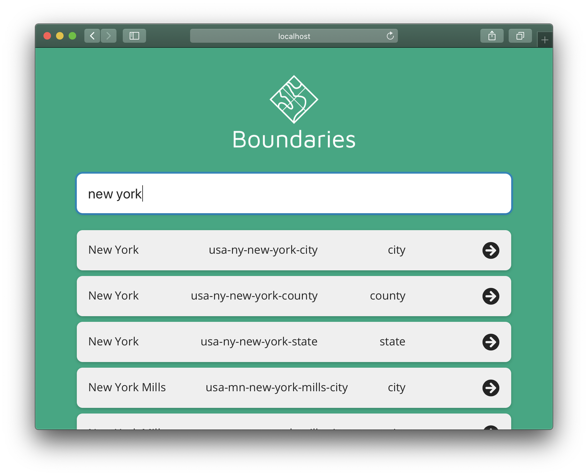

# boundaries.search
> Search for [boundaries.world](http://boundaries.world/)





### Updating the search list

To update the results in `files.json`

```
git clone git@github.com:staeco/boundaries.git
go run main.go
```

MIT
